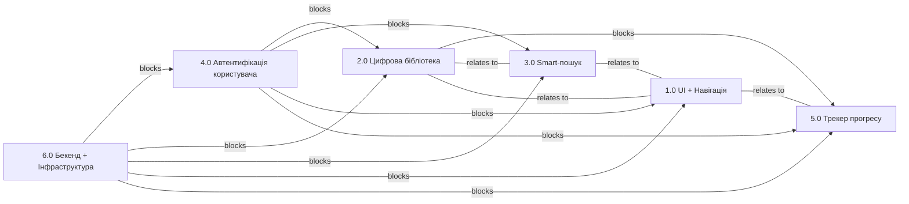

# 2.5 Dependency Mapping (міжфункціональні залежності)

У цьому документі описано, як у таск-трекері побудувати зв'язки між Epic (Issue Links) та як візуалізувати критичний шлях (Critical Path) для MVP.

---

## 1. Технічна реалізація зв'язків (Issue Links)

Для кожного Epic у Jira додайте **Issue Links** згідно з логікою залежностей.

### Види зв'язків (Issue Link Types)
- **Blocks / Is blocked by** — блокуючі залежності (критичні точки, де без одного Epic інший не починається).
- **Finish-to-Start** — жорстка послідовність (реалізація Epic Б починається після завершення Epic А).
- **Relates to** — асоціативний зв’язок (Epic мають спільну логіку/дані, але можуть працювати паралельно).

---

## 2. Рекомендовані залежності між Epic

### Критичний шлях (Critical Path) — MVP
(затримка цих Epic призведе до затримки всього релізу MVP)

1. **6.0 Бекенд + Інфраструктура (DB, API, CI/CD)**
   - **blocks** → 4.0 Автентифікація користувача
   - **blocks** → 2.0 Цифрова бібліотека
   - **blocks** → 3.0 Smart-пошук
   - **blocks** → 1.0 UI + Навігація
   - **blocks** → 5.0 Трекер прогресу

2. **4.0 Автентифікація користувача**
   - **blocks** → 2.0 Цифрова бібліотека
   - **blocks** → 3.0 Smart-пошук
   - **blocks** → 1.0 UI + Навігація (частково, якщо UI демонструє захищені розділи)
   - **blocks** → 5.0 Трекер прогресу

3. **2.0 Цифрова бібліотека (списки книг)**
   - **blocks** → 5.0 Трекер прогресу (бо трекер зберігається у тому ж списку/моделі)
   - **relates to** → 3.0 Smart-пошук (дані з пошуку потрапляють у бібліотеку)

4. **3.0 Smart-пошук (Google Books API)**
   - **relates to** → 1.0 UI + Навігація (UI інтегрує блок пошуку)

5. **1.0 UI + Навігація**
   - **relates to** → всі інші Epic (UI є “сполучною тканиною” для користувача)

---

## 3. Візуалізація (Dependency Graph)

Нижче наведена базова мережа залежностей в Mermaid‑форматі. Ви можете вставити цей блок у будь-який Markdown, який підтримує Mermaid, або перенести у Miro/Draw.io.

> **Критичний шлях** (Critical Path) за цією моделлю: **Infra → Auth → Library → Progress** (тому що відсутність будь-якого з цих Epic затримує MVP).

---

## 4. Поради для роботи в Jira
- Додавайте **Issue Links** відразу після створення Epic, щоб не загубити залежності.
- Якщо Epic блокується, обов’язково додавайте коментар із причиною (детальний контекст для команди).
- Періодично переглядайте Dependency Graph у плануванні (Portfolio / Advanced Roadmaps / Miro), щоб виявляти «тісні місця» (bottlenecks).
